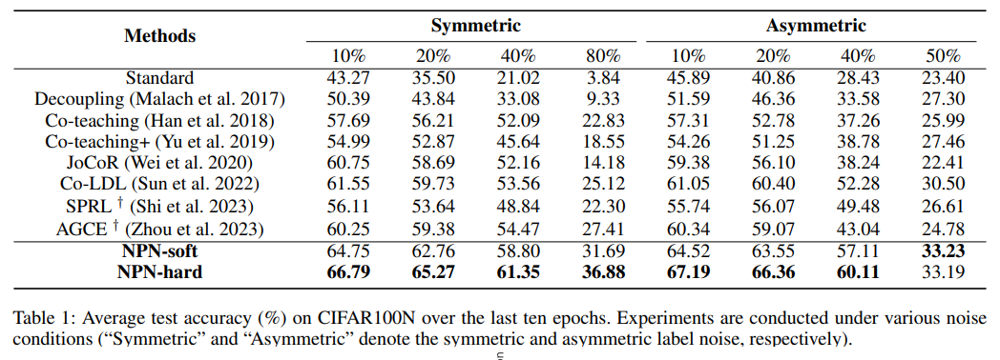
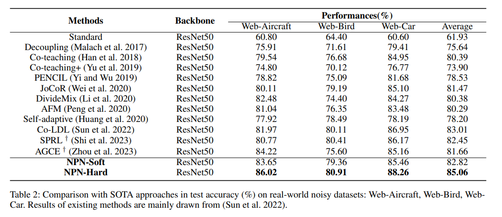

# NPN: Adaptive Integration of Partial Label Learning and Negative Learning for Enhanced Noisy Label Learning
**Abstract:** Recently, there has been significant attention on the effectiveness of various domains, such as semi-supervised learning, contrastive learning, and meta-learning, in enhancing the performance of methods for noisy label learning (NLL) tasks.
However, most existing methods still make limited assumptions regarding clean samples amidst different sources of noise (\eg, a pre-defined drop rate or a small subset of clean samples).
In this paper, we propose a simple yet powerful idea called NPN, which revolutionizes Noisy label learning by combining two other learning methodologies: Partial label learning (PLL) and Negative learning (NL).
Toward this goal, we initially decompose the given label space adaptively into the candidate and complementary labels, thereby establishing the conditions for PLL and NL.
We propose two adaptive data-driven paradigms of label disambiguation for PLL: hard disambiguation and soft disambiguation.
Furthermore, we conduct reliable complementary labels using all non-candidate labels for NL to enhance model robustness through indirect supervision.
To maintain label reliability during the later stage of model training, we introduce a consistency regularization term that encourages agreement between the outputs of multiple augmentations.
Experiments conducted on both synthetically corrupted datasets and real-world noisy datasets demonstrate the superiority of NPN compared to other state-of-the-art (SOTA) methods.

# Pipeline


# Installation
```
pip install -r requirements.txt
```

# Datasets
We conduct noise robustness experiments on a synthetically corrupted dataset (i.e., CIFAR100N) and three real-world datasets (i.e., Web-Aircraft, Web-Car and Web-Bird).
Specifically, we create the noisy dataset CIFAR100N based on CIFAR100.
We adopt two classic noise structures: symmetric and asymmetric, with a noise ratio $n \in (0,1)$.

You can download the CIFAR10 and CIFAR100 on [this](https://www.cs.toronto.edu/~kriz/cifar.html).

You can download Web-Aircraft, Web-Car, and Web-Bird from [here](https://github.com/NUST-Machine-Intelligence-Laboratory/weblyFG-dataset).

# Training

An example shell script to run NPN-hard on CIFAR-100N :

```python
CUDA_VISIBLE_DEVICES=0  python NPN-hard.py --gpu 0  --warmup-epoch 200 --epoch 300 --batch-size 128 --lr 0.05 --warmup-lr 0.05  --noise-type symmetric --closeset-ratio 0.2 --lr-decay cosine:200,5e-5,300 --opt sgd --dataset cifar100nc --topk 2 --log NPN-hard 
```
An example shell script to run NPN-hard on CIFAR-100N :

```python
CUDA_VISIBLE_DEVICES=0  python NPN-soft.py --gpu 0  --warmup-epoch 200 --epoch 300 --batch-size 128 --lr 0.05 --warmup-lr 0.05  --noise-type symmetric --closeset-ratio 0.2 --lr-decay cosine:200,5e-5,300 --opt sgd --dataset cifar100nc --topk 2 --log NPN-soft 
```
Here is an example shell script to run NPN-hard on Web-Aircraft :

```python
CUDA_VISIBLE_DEVICES=0  python NPN-web.py --warmup-epoch 40 --epoch 100 --batch-size 32 --lr 0.008 --warmup-lr 0.005  --lr-decay cosine:40,5e-5,100 --opt sgd --dataset web-aircraft --model Resnet50 --gpu 0
```

# Results on Cifar100N:




# Results on Web-Aircraft, Web-Bird, and Web-Car:




# Effects of different components in test accuracy (%) on CIFAR100N:


